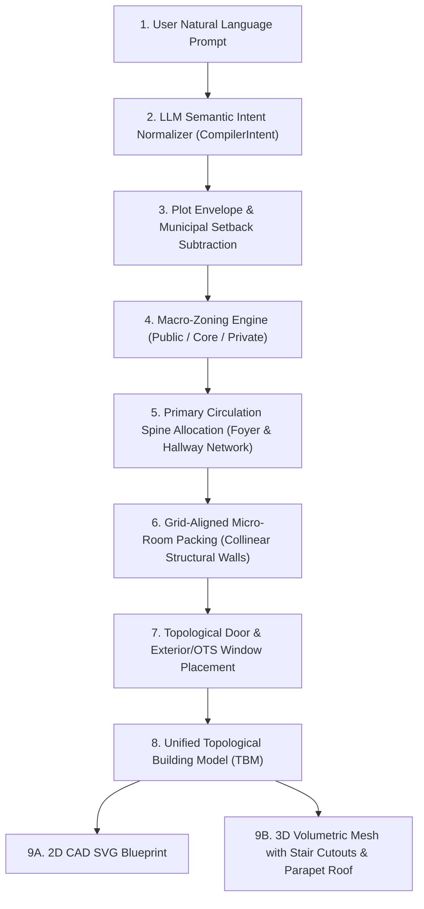

# Hierarchical & Circulation-First Layout Engine Roadmap

## 1. Executive Summary & Problem Diagnosis

### 1.1 The Core Problem
The existing layout generation engine packs rooms as arbitrary rectangular boxes without architectural hierarchy. This results in:
* **The "2D Knapsack / Bin-Packing" Phenomenon**: The Mixed-Integer Linear Programming (MILP) solver packs rooms wall-to-wall to minimize perimeter and maximize occupied area without allocating dedicated circulation space.
* **Missing Circulation Spine**: Bedrooms open directly into kitchens, bathrooms open into living rooms, or rooms become landlocked with zero physical access.
* **Jagged "Floating Block" Walls**: Uncoordinated continuous coordinates produce arbitrary wall offsets ($X = 12.5, 13.0, 14.5$), creating chaotic micro-jogs.
* **Non-Architectural Room Dimensions**: Rooms are constrained only by area ($W \times H \ge A$), producing unbuildable proportions (e.g., $7.5 \times 13.3\text{ ft}$ bedrooms or square cramped bathrooms).
* **Disconnected Geometry Pipelines**: Divergence between `compiler.py` and the TBM CAD kernel (`geometry_resolver.py` / `relationship_builder.py`) causes wall thickness, setback, and opening discrepancies between 2D SVGs and 3D models.
* **3D Volumetric Deficiencies**: Floor slabs are solid across the entire plot with no stairwell cutouts, causing stairs to collide with solid concrete ceiling slabs.

---

## 2. Target System Architecture



---

## 3. Core Implementation Phases & Milestones

### Phase 1: Macro-Zoning & Circulation Spine Formulation

#### 1.1 Macro-Zoning Grammar
Group rooms into 3 distinct functional depth/orientational bands:
* **Front / Public Zone ($0\% - 35\%$ plot depth from road)**:
  * `Entrance Foyer`, `Front Verandah`, `Living Room`, `Powder Room / Guest Bath`.
* **Middle / Service & Core Zone ($30\% - 65\%$ plot depth)**:
  * `Staircase Core / Lift Shaft`, `Dining Room`, `Kitchen`, `Utility / Washing`, `Circulation Hallway`.
* **Rear / Private Zone ($60\% - 100\%$ plot depth)**:
  * `Master Bedroom`, `Secondary Bedrooms`, `Attached Bathrooms`, `Walk-in Closets`, `OTS Lightwells`.

#### 1.2 Dedicated Circulation Spine
* Define a continuous **walkable corridor backbone** with a minimum width of $3.5\text{ ft}$ ($4.0\text{ ft}$ for multi-unit/shared access).
* Anchor the circulation spine between the entrance foyer, stairwell, and private bedroom entries.

---

### Phase 2: Structural Grid Snapping & Collinear Wall Alignment

#### 2.1 Collinear Alignment Constraints
* For any two adjacent rooms sharing a boundary on the $X$ or $Y$ axis:
  * Enforce $|X_{1,\text{edge}} - X_{2,\text{edge}}| \le \epsilon \implies X_{1,\text{edge}} = X_{2,\text{edge}}$.
  * Forbid small structural jogs ($\text{jog} \in (0.1\text{ ft}, 2.5\text{ ft})$).
* Snap room corners to a structured architectural grid ($0.5\text{ ft}$ or $1.0\text{ ft}$ increments) to maintain straight, continuous partition walls.

#### 2.2 Functional Room Dimensions & Minimum Clearances
Enforce standard architectural dimension envelopes:
* **Living Room**: Minimum width $11.0\text{ ft}$, aspect ratio $1.1 - 1.5$.
* **Master Bedroom**: Minimum width $11.0\text{ ft}$, minimum depth $12.0\text{ ft}$ (fits $6.5\text{ ft}$ bed + $3\text{ ft}$ side clearances + $2\text{ ft}$ wardrobe).
* **Secondary Bedroom**: Minimum width $10.0\text{ ft}$, minimum depth $10.0\text{ ft}$.
* **Kitchen**: Minimum width $7.0\text{ ft}$, minimum depth $8.0\text{ ft}$ (fits parallel counters and $3\text{ ft}$ work aisle).
* **Bathroom**: Standard linear ratio $1.4 - 1.8$ (min $4.5 \times 7.0\text{ ft}$ or $5.0 \times 8.0\text{ ft}$).
* **Corridor**: Minimum width $3.5\text{ ft}$.

---

### Phase 3: Topological Ventilation, Privacy & Door/Window Anchoring

#### 3.1 Procedural OTS Shaft Allocation
* Fix topological ray-casting in `calculate_ventilation_and_ots()` so landlocked rooms in dense or rowhouse plots reliably generate dedicated Open-To-Sky shafts ($3 \times 3\text{ ft}$ minimum).

#### 3.2 Circulation-Anchored Door Placement
* Place room access doors exclusively along walls shared with the circulation spine or foyer.
* Enforce a minimum corner offset of $6\text{ inches}$ from room corners to allow proper door frame installation and full $90^\circ$ door swings.
* Support ensuite bathrooms opening directly into their parent bedroom.

#### 3.3 Exterior & OTS Window Placement
* Place exterior windows on perimeter walls touching setbacks and on OTS shafts with minimum wall span $\ge 4.0\text{ ft}$.
* Position the Main Exterior Entrance Door strictly on the front road facade.

---

### Phase 4: Unified 2D CAD & 3D Volumetric Mesh Realization

#### 4.1 Single Source of Truth: Topological Building Model (TBM)
* Deprecate legacy bounding-box compilation in `compiler.py` in favor of the full TBM kernel (`Building`, `Wall`, `Junction`, `Opening`, `Room`, `Floor`).
* Deduplicate shared partition centerlines using Shapely GEOS line noding (`unary_union`).

#### 4.2 3D Volumetric Mesh Refinements
* **Parametric Stairwell Slab Cutout**: Subtract the stair core polygon from intermediate floor slab meshes in `BuildingViewer3D.jsx` so stairs penetrate upper floors cleanly.
* **Parametric Roof Terrace & Parapet**: Add a top terrace slab with a $3.0\text{ ft}$ perimeter parapet wall for realistic volumetric home rendering.
* **Column Grid Alignment**: Render structural column pillars along actual TBM column coordinates.

---

## 5. Verification & Testing Standards

1. **Automated Suite**:
   ```powershell
   .\venv\Scripts\python.exe -m pytest tests/test_engine.py -v
   .\venv\Scripts\python.exe -m pytest tests/test_corridor_router.py -v
   .\venv\Scripts\python.exe -m pytest tests/api/test_requirement_modification_loop.py -v
   ```
2. **Benchmark Golden Scenarios**:
   * **Scenario A (Standard 30x40 ft Plot, 2BHK Ground Floor)**: Clean front Living, central Kitchen/Dining, rear Bedrooms + Baths, zero wall micro-jogs.
   * **Scenario B (Duplex 40x40 ft Plot, G+1 with Stairs)**: Ground-to-first floor vertical alignment, clean stair core penetration in 3D, and privacy zoning.
   * **Scenario C (Narrow 20x50 ft Row House)**: Procedural OTS shaft generation for landlocked middle rooms.
